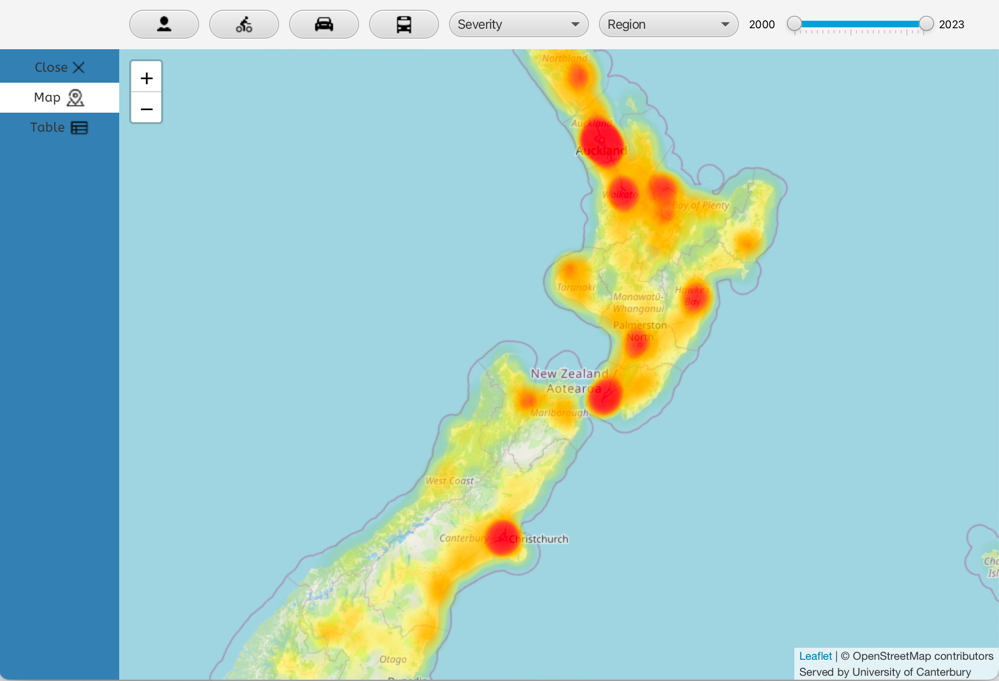

# SENG202 - Team 2 JCENA

## Overview
This application is created for users to view New Zealand crash data provided by Waka Kotahi. It provides both a heatmap of the crash densities and a table for viewing the crashes, and the ability to filter the crashes by different properties. The primary stakeholders of the application are learner and restricted drivers, along with their supervisors.

## Authors
- Ben Moore
- Findlay Royds
- Harrison Parkes
- Isaac Ure
- James Lanigan
- Louis Hobson
- Matthew Lang

## Prerequisites
- JDK >= 17 [click here to get the latest stable OpenJDK release (as of writing this README)](https://jdk.java.net/18/)
- Gradle [Download](https://gradle.org/releases/) and [Install](https://gradle.org/install/)

## What's Included
- This project includes two main ways of viewing the crash data; a heatmap overlayed on a map of new zealand, and a paginated table view.
- A collapsable side bar to switch between the heatmap and table view.
- A top bar with options for filtering the crashes by the following properties:
    - Year of the crash as a double ended slider.
    - Region the crash occured in as a drop down menu.
    - Severity of the crash as a drop down menu.
    - Vehicle type involved in the crash with toggle buttons.

## Running the Bundled Jar
You can run the bundled .jar file by opening a terminal window in the project directory and executing `java -jar seng202_2023_team2_3.jar`

## Importing Project (Using IntelliJ)
IntelliJ has built-in support for Gradle. To import your project:

- Launch IntelliJ and choose `Open` from the start up window.
- Select the project and click open
- At this point in the bottom right notifications you may be prompted to 'load gradle scripts', If so, click load
- When importing the project from source the New Zealand crash data needs to be included, as it is not provided in the remote repository. The crash data can be found at the [Seng202 Learn page](https://learn.canterbury.ac.nz/course/view.php?id=18812&section=4), under the link named "Simple crash data full". This CSV file then needs to be included at: src/main/resources/crash_data.csv.

**Notes:**
- *If you run into dependency issues when running the app or the Gradle pop up doesn't appear then open the Gradle sidebar and click the Refresh icon.*
- *The .jar packaged for public release includes the crash data. Only the developers and teaching team are expected to import the project into IntelliJ from source.*

## Build Project
1. Open a command line interface inside the project directory and run `./gradlew jar` to build a .jar file. The file is located at `build/libs/seng202_team2-1.0.jar`

## Additional Documentation
Additional documentation of the project, including policies and team documentation can be found in the project's [GitLab Wiki](https://eng-git.canterbury.ac.nz/seng202-2023/team-2/-/wikis/home).
